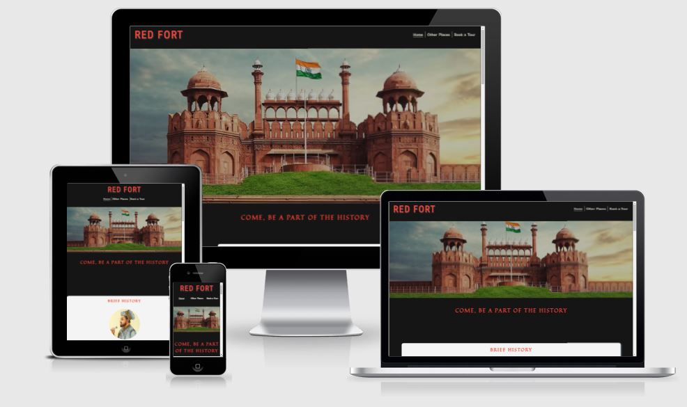
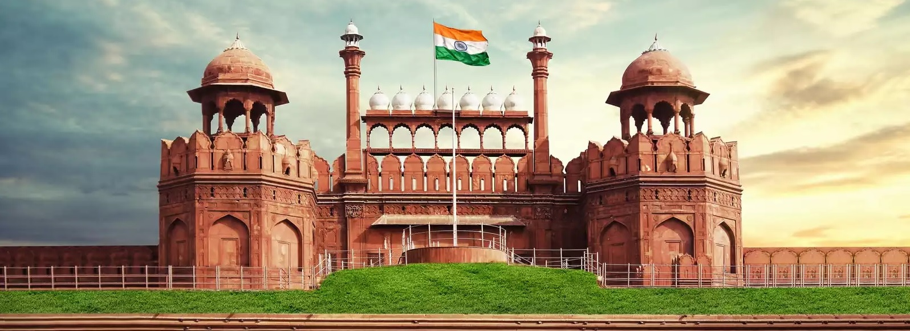
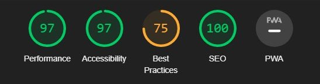

# RED FORT

[View The Live Project Here](https://farrukh-ahm.github.io/Portfolio-Project-1/)

This is a promotional website for the monument Red Fort, situated in Delhi, India, to boost Delhi Tourism. 
This website aims at providing basic information about the fort, its location and entices the tourists to visit. 
It also aims at easing the tour booking process for the visitors by providing an easy-to-fill form and avail the service of guided tour for a more interactive and educational experience.



## Features:

   ### UI/UX:

   - #### Colour Scheme
      1. The two main colours used are Mardi Gras and Pomegranate Red.
      2. The information card colours are Anti-Flash White and Light Gray to contrast the dark background of the webpage, while the text uses darker shade of gray to pop out.

   - #### Typography
      1.  The Zen Kaku Gothic Antique font is the main font used throughout the whole website with Sans Serif as the fallback font in case for any reason the font isn't being imported into the site correctly. The website header uses Roboto condensed font with sans-serif as backup and the semi-headings of the webpage and the information cards use Quintessential font with cursive as the backup font.
      2. The Zen Kaku font gives the heading a very sober and decent appearance, while the Quintessential font for semi-headers provide a classic feel to the website, complimenting the objctive of the webpage.
      3. The body font of Roboto condensed is easy to read and is easy on eyes.
   
   ### Existing Features:

   1. #### Navigation Bar 
    
       -   Along with the name of the website, the navigation bar includes the links to all the pages of the website, Home, Other Places and Book a Tour. This is featured on all the pages of the website.
       -   Through the navigation bar, the user can easily move around and take full advantage of all the features provided by the website.

        <br>
        
        <br>

   2. #### The Landing Page Image
    
       - The landing page image shows the monument from the front, hence visually engaging the visitors on the website.

        <br>
        
        <br>

   3. #### Information Section

        - History:
            - This information card serves as an introductory section for the visitors who can familiarise themselves with the monument, by gaining a brief insight into its history.
            <br>
            
            <br>

        - Architecture:
            - This information card provides a brief explanation of the architectural inspirations for the monument.
            - Some visitors are more interested in ancient architecture and this section caters to those needs of the users.
            <br>
            
            <br>

        - Present Day:
            - This information card provides the present-day scenario of the monument, the changes brought to the place and how it is celebrated in these times.
            <br>
            
            <br>

   4. #### Visit Us Section

        - Interested users can access the information on how to reach the place and the timings that would best suit their interests.
        - This section provides a detailed address of the fort, along with a Google Map for ease of navigation.
        <br>
        
        <br>

   5. #### Footer Section
        - The Footer Section holds and displays the links to the social media profiles dedicated to the Red Fort and opens in a new tab.
        - This section is in contrast to the background of the webpage and displays the icons of the respective social media links, which a user can easily access.
        - It is dispalyed on all the pages of the website.
        <br>
        
        <br>

   6. #### Other Places Page
        - This page provides the visitors to the website with more options of places they can visit while in Delhi, to help further boost Delhi Tourism.
        - There are 4 information cards with the names of the monuments and a brief description of the historical structures, some in close proximity to the Red Fort itself.
        <br>
        
        <br>

   7. #### Book a Tour
        - For tourists/visitors who want to experience a more detailed and entertaining tour of the Red Fort, they can opt for a guided tour through the form provided on this page.
        - It's easy to fill and book, the users are notified with a confirmation message on a new page, and they can easily navigate back via Home button provided below the message or through the navigation bar.
        - Clicking on the "Book!" button takes the users to a new page which is a form-dump page. For now, this page is a dummy, and uses the GET method instead of POST. It's just for demo purposes.
        <br>
        
        <br>

## Technologies Used

### Languages Used

-   [HTML5](https://en.wikipedia.org/wiki/HTML5)
-   [CSS3](https://en.wikipedia.org/wiki/Cascading_Style_Sheets)

### Frameworks, Libraries & Programs Used

1. [Google Fonts:](https://fonts.google.com/)
    - Google fonts were used to import the 'Quintessential', 'Roboto Condensed' and 'Zen Kaku Gothic Antique' font into the style.css file which is used on all pages throughout the project.
2. [Font Awesome:](https://fontawesome.com/)
    - Font Awesome was used on all pages throughout the website to add icons for aesthetic and UX purposes.
3. [Git](https://git-scm.com/)
    - Git was used for version control by utilizing the Gitpod terminal to commit to Git and Push to GitHub.
4. [GitHub:](https://github.com/)
    - GitHub is used to store the project's code after being pushed from Git.
5. [Balsamiq:](https://balsamiq.com/)
    - Balsamiq was used to create the wireframes during the design process.

## Testing
The website has been tested on different devices and screen sizes, eg. a 21.5inch monitor, 15inch laptop screen, iPad and Android devices. The website runs smoothly and generates appropriate results without any issues. The hover effect on information cards work properly on the computer, the links take you to appropriate pages and the submit button on the form page takes you to the form-dump page with the proper message for submission displayed. The social media links in the footer open the associated pages in new tab, as intended.

The W3C Markup Validator and W3C CSS Validator Services were used to validate every page of the project to ensure there were no syntax errors in the project.

-   [W3C Markup Validator](https://validator.w3.org/#validate_by_input) - [Results](https://validator.w3.org/nu/?doc=https%3A%2F%2Ffarrukh-ahm.github.io%2FPortfolio-Project-1%2F)
-   [W3C CSS Validator](https://jigsaw.w3.org/css-validator/#validate_by_input) - [Results](https://jigsaw.w3.org/css-validator/validator?uri=https%3A%2F%2Ffarrukh-ahm.github.io%2FPortfolio-Project-1%2Findex.html&profile=css3svg&usermedium=all&warning=1&vextwarning=&lang=en)

The website was also tested through Lighthouse on Chrome for its Accessibility Score.<br>



## Known Bugs
On some iPhone devices, the buttons on the Form page do not display properly. This is mostly due to the higher pixel density on iPhones. Attempted to resolve this by using more media queries with different widths and webkit device pixel ratios, but it didn't work. It's difficult to properly fix this issue as it displays properly on Chrome and Firefox's dev tools with simulated mobile screens, including iPhone screens. However, upon deploying and opening the website on the actual iPhone device itself, it shows issues. This will need further investigation. No other known bugs were found after numerous testings.

## Deployment
The project was deployed to GitHub Pages using the following steps...

1. Log in to GitHub and locate the [GitHub Repository](https://github.com/farrukh-ahm/Portfolio-Project-1.git)
2. At the top of the Repository (not the top of the page), locate the "Settings" Button on the menu.
3. On the Settings page, locate the "Pages" link on the left side, under the "Code and Automation" category. 
4. Under "Source", click the dropdown called "None" and select "Master Branch" or "Main".
5. The page will automatically refresh.
6. Scroll back down through the page to locate the now published site [link](https://farrukh-ahm.github.io/Portfolio-Project-1/) in the "GitHub Pages" section.

## Credits

* ### Content

    - The content for the History, Architect and Present Day was taken from Red Fort's [Wikipedia](https://en.wikipedia.org/wiki/Red_Fort) and [Britannica](https://www.britannica.com/topic/Red-Fort) entries.
    - The content for the [Qutab Minar](https://delhitourism.gov.in/delhitourism/tourist_place/qutab_minar.jsp) and [Jama Masjid](https://delhitourism.gov.in/delhitourism/tourist_place/jama_masjid.jsp) were taken from the Delhi Tourism website.
    - The content for the India Gate was taken from the [IncredibleIndia](https://www.incredibleindia.org/content/incredible-india-v2/en/destinations/delhi/india-gate.html) website.
    - The content for the Humayun's Tomb was taken from the [WHC-UNESCO](https://whc.unesco.org/en/list/232/) website.

* ### Media

    - All the images used on the website are free-to-use provided by [Unsplash](https://unsplash.com/).
    - The images are hosted by the following photographers as mentioned on the website:
        1. Main page banner: Swapnil Deshpandey
        2. Other-Places banner: Godwin Angeline Benjo
        3. Architect: Mohd. Sharif
        4. Present Day: Tarun Anand Giri
        5. Qutab Minar: Rituraj Pankaj
        6. India Gate: Shalender Kumar
        7. Jama Masjid: Mayur Sable
        8. Humayun’s Tomb: Unknown Traveller
        9. Book A Tour page background: Jan Canty
    - Shah Jahan image (History Section): https://www.pngwing.com/en/free-png-nnjyy 

* ### Code

The following code block used from [Stack Overflow](https://stackoverflow.com), answer given to following question on the given link:<br>
[How to make body background image transparent in css? (sirdn4)](https://stackoverflow.com/questions/42312909/how-to-make-body-background-image-transparent-in-css/42313865)

```
body::after {
  background: url(“</address>”);
  content: "";
  opacity: 0.9;
  position: absolute;
  top: 0;
  bottom: 0;
  right: 0;
  left: 0;
  z-index: -1;   
}
```

## Acknowledgements

- My mentor for continuous help and valuable feedback.
- Tutor support at Code Institute for their support.
